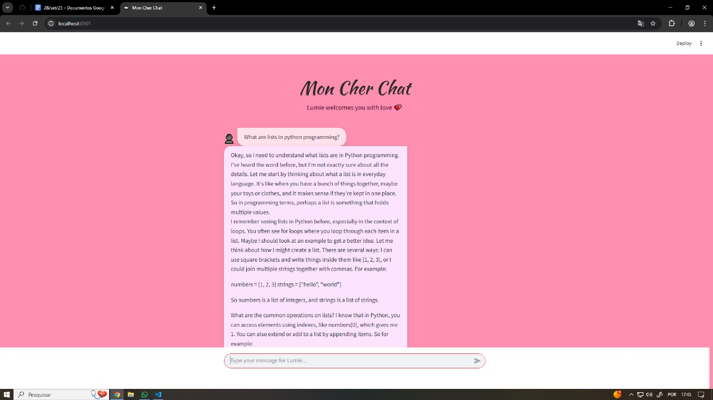
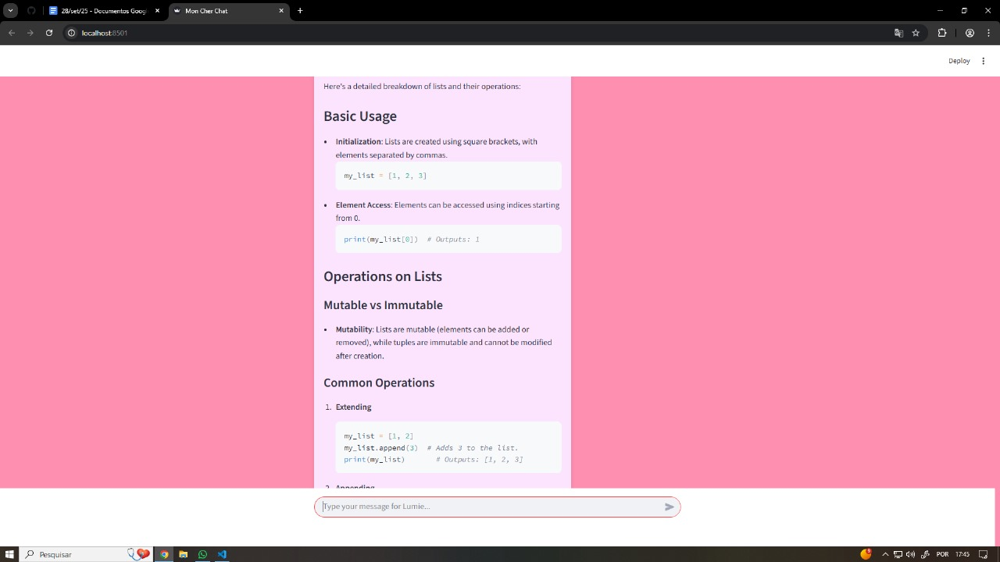
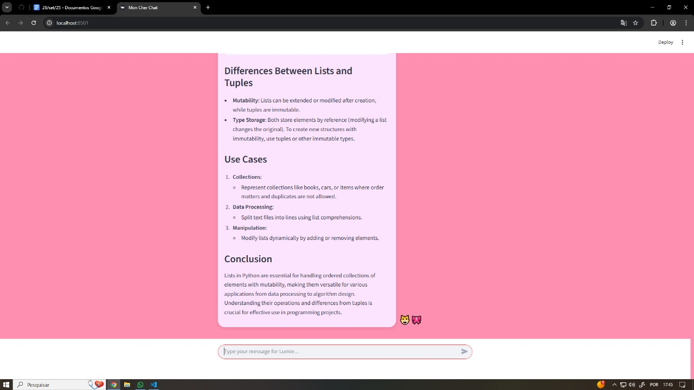

#  Mon Cher Chat: Chatbot com LLM Local e Privado

## Visão Geral do Projeto

O **Mon Cher Chat** é um protótipo de chatbot conversacional que demonstra a capacidade de rodar um Large Language Model (LLM) de alta performance, o **DeepSeek-R1**, diretamente na máquina local, utilizando o **Ollama** como runtime e **Streamlit** para a interface web interativa.

Este projeto foca em **privacidade, controle total sobre os dados** e a demonstração de uma arquitetura de IA leve e eficiente para o seu portfólio.

### 🚀 Destaques Técnicos

* **Execução Local:** Garantia de que todas as conversas e dados permanecem na sua máquina, sem depender de APIs ou serviços em nuvem.
* **DeepSeek-R1:** Utilização de um modelo *open-source* com capacidade de raciocínio avançada, comparável a modelos líderes como O3 e Gemini 2.5 Pro.
* **Memória Conversacional:** Implementação de um mecanismo de estado (`st.session_state`) que permite à IA manter o contexto e a coerência em diálogos longos.
* **Interface Streamlit:** Criação de uma interface de chat responsiva e elegante usando Python.

## 🏗️ Arquitetura e Tecnologias

| Categoria | Ferramenta / Tecnologia | Função no Projeto |
| :--- | :--- | :--- |
| **LLM (Modelo)** | **DeepSeek-R1:1.5b** | O modelo de linguagem central que gera as respostas. |
| **LLM Runtime** | **Ollama** | Responsável por baixar, servir e expor o LLM através de uma API local. |
| **Interface Web** | **Streamlit** | Framework Python para o desenvolvimento rápido da interface de usuário. |
| **Lógica** | **Python 3.x + LangChain** | Linguagem principal e biblioteca para gerenciar a comunicação com o Ollama e a memória do chat. |
| **Código Fonte** | `app.py` | Script principal que orquestra a UI, memória e a chamada `llm.invoke()`. |

## 💻 Como Usar (Passo a Passo)

Para rodar este chatbot, você precisa ter o Git, o Python e o Ollama instalados na sua máquina.

### Passo 1: Configurar Ambiente e LLM

1.  **Instale o Ollama** (se ainda não o fez).
2.  **Baixe o modelo DeepSeek-R1:**
    ```bash
    ollama pull deepseek-r1:1.5b
    ```

### Passo 2: Clonar e Instalar Dependências

1.  **Clone o repositório:**
    ```bash
    git clone https://github.com/sophialouiserdl/mon-cher-chat-llm.git
    cd mon-cher-chat
    ```
2.  **Instale as dependências Python:**
    ```bash
    pip install -r requirements.txt
    ```

### Passo 3: Executar o Chatbot

1.  Certifique-se de que o Ollama esteja rodando em segundo plano.
2.  Execute a aplicação Streamlit:
    ```bash
    streamlit run app.py
    ```
A interface do chat será aberta automaticamente no seu navegador.

---

## 🖼️ Demonstração

O chat Mon Cher Chat em funcionamento, mostrando a interface Streamlit e a resposta do DeepSeek-R1.

<p align="center">
  
</p>

<p align="center">
  
</p>

<p align="center">
  
</p>

---
